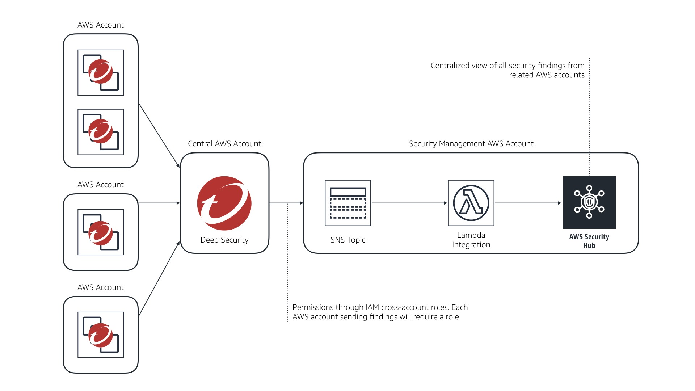
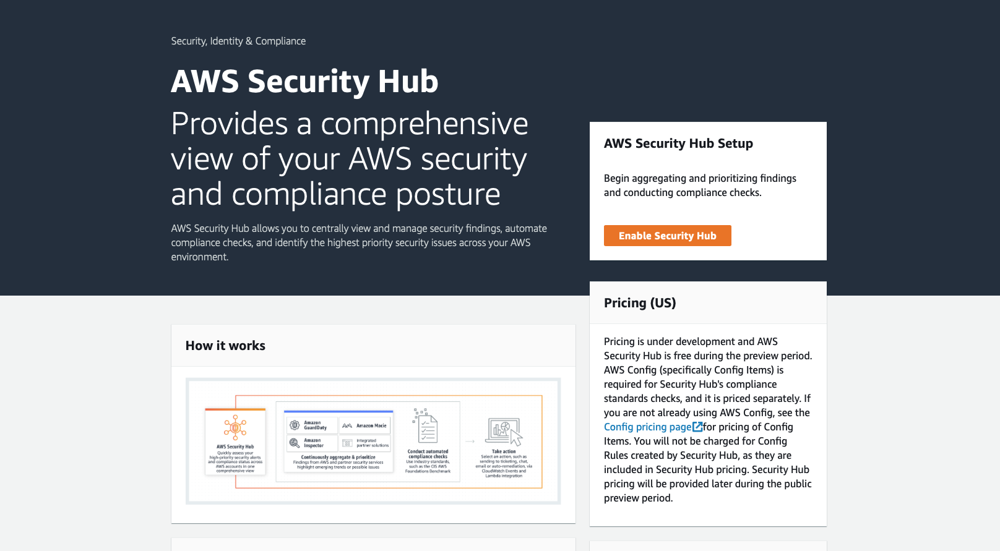
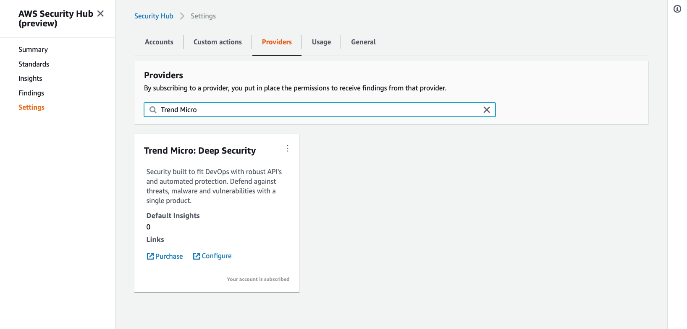

> AWS Security Hub is currently in open preview. That means we can expect changes as the AWS service team responds to customer requirements and requests. We'll also be iterating on this integration in order to make it work better and deploy more smoothly.
>
> Please feel free to open an issue or submit a PR as required.

# AWS Security Hub Integration for Deep Security Manager

AWS Security Hub provides a comprehensive view of your high priority security alerts and compliance status for your AWS deployment. By combining data from [Amazon GuardDuty](https://aws.amazon.com/guardduty/), [Amazon Inspector](https://aws.amazon.com/inspector/), and [Amazon Macie](https://aws.amazon.com/macie/) along with a host of [APN partner solutions](https://aws.amazon.com/security/partner-solutions/), the AWS Security Hub is a one-stop shop for security visibility.

Each data source provides various findings relevant to the tool. Amazon Macie will send findings related to data within Amazon S3 buckets it monitors, Amazon GuardDuty will provide findings based on the assessments it runs on your Amazon EC2 Instances, and so forth.

This repository contains AWS Lambda scripts to supply data from **your** Deep Security install to AWS Security Hub.

## Table of Contents

* [Design](#design)
* [Findings](#findings)
* [Support](#support)
* [Contribute](#contribute)

## Design

Deep Security has long had a feature to send events to an Amazon SNS topic. This integration takes advantage of that feature to filter and convert specific events in order to send them as findings to the AWS Security Hub.

The design is:

## Deployment

### Configure Deep Security to Send Events to Amazon SNS

To configure Deep Security Manager to send all events to Amazon SNS, follow the steps in the [Deep Security Help Center](https://help.deepsecurity.trendmicro.com/sns.html).

By default, this configuration sends all Deep Security events to the specified Amazon SNS topic. You can [filter what events are sent](https://help.deepsecurity.trendmicro.com/Events-Alerts/sns-json-config.html) using a simple JSON policy language (very similar to AWS IAM).

This integration only uses a subset of Deep Security events. Essentially only sending critical and high severity events to AWS Security Hub by default. This class of events is more closely related to the core concept of an AWS Security Hub finding.

**Caution:** If you use the Deep Security event policy language to prevent sending relevant events to an Amazon SNS topic, those events won't show up in the AWS Security Hub. This is unlikely to happen but something to be aware of if you're filtering the event stream outbound from your Deep Security installation.

### Configure AWS Security Hub

AWS Security Hub is available as an open preview. Simply access the service from the AWS Management Console and click "Enable Security Hub".

This will walk you through the initial process of setting up the required permissions and structures to support the AWS Security Hub. 

Once that initial step is complete, you need to subscribe to Trend Micro's Deep Security in order to permit the service to receive events from your Deep Security installation.

### Configure the AWS Lambda Function

Using the CloudFormation template in this repository, you can easily deploy the required AWS Lambda function and assign the proper permissions via the AWS IAM execution role.

The code requires these permissions to run:

- read access to the target Amazon SNS topic that Deep Security is sending events to
- write access to the AWS Security Hub API, specifically the ImportFindings function calls

### Configuring AWS IAM Permissions

Deep Security allows you to setup multiple AWS accounts under one installation. This means that events information from multiple AWS accounts may be flowing to one centralized AWS Security Hub.

This is typically the desired result.

**But** in order to prevent spoofing of findings, AWS Security Hub restricts source accounts. By default, you cannot send events from account B to the AWS Security Hub in account A.

In order to enable this functionality, the integration supports assuming an IAM role in account B when called from account A.

That creates a work flow of:

- account A hosts the integration function for AWS Lambda
- account A's function receives an event flagged as account B
- the integration function assumes a role in account B
- the integration function then sends the event as a finding from account B to the AWS Security Hub in account A

In order to simplify the creation of this role, we've [provided an Amazon CloudFormation template](cf-deep-security-aff-forward-to-aws-security-hub.yaml) in the repository. This template should be run in account B with the parameter of *TargetHubAccountId* set to account A.

## Findings

Deep Security uses these core event types:

- *SystemEvent* - Generated by Deep Security as a platform. Includes events like agent updates, communication issues, etc.
- *PacketLog* - Generated by the firewall control. Possible events include, packet denied, communication permitted, and others
- *PayloadLog* - Generated by the intrusion prevention control. Includes events like malicious payload found, generic attempt detection, communications dropped, and others
- *AntiMalwareEvent* - Generated by the anti-malware control. Possible events include, detection, quarantine of malware, and others
- *WebReputationEvent* - Generated by the web reputation control. This checks outgoing HTTP requests against known bad URLs. Possible events include a malicious URL requested, possible data exfiltration, and others
- *IntegrityEvent* - Generated by the integrity monitoring control. Possible events include folder modification, file write, and others
- *LogInspectionEvent* - Generated by the log inspection control. Possible events include brute force login attempt, password changes, and others
- *AppControlEvent* - Generated by the application control control. Possible events application launch prevented, signature updated due to new deployment, and others

Each of these event types has different properties that contain details relevant to the event type. AppControlEvent's contain information about the application execution lifecycle. AntiMalwareEvents contain information that details the malware detected. And so on.

There are common identifying properties for all event types (Deep Security TenantID, timestamp, etc.) and some similarities even if the structure is a bit different.

In order to properly select events to send to the AWS Security Hub, this integration uses this logic:

- *Severity* for intrusion prevention and integrity monitoring events. This property uses a simple scale of 1—4 with 4 being "critical". Events that are a 3 or a 4 are automatically sent to AWS Security Hub
- *Risk* for web reputation events. Any event tagged as a 3 (suspicious) or 4 (dangerous) will automatically be sent to AWS Security Hub
- *OSSEC_Level* for log inspection events. This property uses a range of 0—15 to indicate severity. Any event flagged between 8—15 (high to critical) will be sent to AWS Security Hub
- *InfectedFilePath* is used in anti-malware events. When present, this indicates the engine has detected malware in the file and taken an action. Any event with this property present will be forwarded to AWS Security Hub
- *RepeatCount* is used in firewall events. In order to /reduce/ the volume of firewall events sent upstream, this property is used to select events when the count is higher than 5

> This is the first level integration. As the AWS Security Hub evolves, more events will be sent upstream in order to help optimize the user experience.

## Support

This is an Open Source community project. Project contributors may be able to help, 
depending on their time and availability. Please be specific about what you're 
trying to do, your system, and steps to reproduce the problem.

For bug reports or feature requests, please 
[open an issue](https://github.com/deep-security/serverless-kms-grants/issues). 
You are welcome to [contribute](#contribute).

Official support from Trend Micro is not available. Individual contributors may be 
Trend Micro employees, but are not official support.

## Contribute

We accept contributions from the community. To submit changes:

1. Fork this repository.
1. Create a new feature branch.
1. Make your changes.
1. Submit a pull request with an explanation of your changes or additions.

We will review and work with you to release the code.